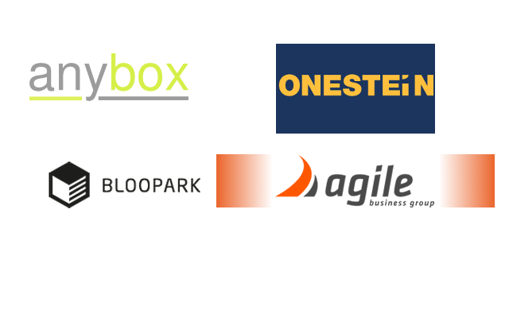

layout: false
class: center, middle, inverse

# odoo testing on steroids

## Leonardo Pistone

## Camptocamp

???

# the title of this talk is

-->

---
# About me

## Leonardo Pistone
* Developer @ Camptocamp
* OCA committer & delegate member
* @lepistone

.camptocamp-logo[

]

???

# spend time on oca

---
class: center, middle

# what I'd love

???

# not a introduction on how to test

# for that, alexandre

---

.right-column[
```python
    def test_no_price_no_tax(self):
        assert compute_tax(0) == 0
```
]

--

.left-column[
```python
def compute_tax(base, rate=0):
    return 0
```
]

--

.right-column[
```python
    def test_zero_rate(self):
        assert compute_tax(50, 0) == 50
```
]

---

.left-column[
```python
def compute_tax(base, rate=0):
    return base
```
]

.right-column[
```python
    def test_no_price_no_tax(self):
        assert compute_tax(0) == 0
```

]

.right-column[
```python
    def test_zero_rate(self):
        assert compute_tax(50, 0) == 50
```
]

--

.right-column[
```python
    def test_positive_rate(self):
        assert compute_tax(100, 0.05) == 105
```
]

.right-column[
```python
    def test_negative_rate(self):
        assert compute_tax(100, -0.05) == 95
```
]
---

.left-column[
```python
def compute_tax(base, rate=0):
    return base * (1 + rate)
```
]

.right-column[
```python
    def test_no_price_no_tax(self):
        assert compute_tax(0) == 0
```

]

.right-column[
```python
    def test_zero_rate(self):
        assert compute_tax(50, 0) == 50
```
]

.right-column[
```python
    def test_positive_rate(self):
        assert compute_tax(100, 0.05) == 105
```
]

.right-column[
```python
    def test_negative_rate(self):
        assert compute_tax(100, 0.05) == 95
```
]

---

```
# python -m unittest discover

....
---------------------
Ran 4 tests in 0.002s

OK


```

--

```


$ python -m unittest discover

F.F.
======================================================================
FAIL: test_positive_rate_increases_amount (test_tax.TestTax)
----------------------------------------------------------------------
Traceback (most recent call last):
  File "tdd/test_tax.py", line 13, in test_positive_rate_increases_amount
    self.assertEqual(compute_tax(100, 0.05), 105)
AssertionError: 100 != 105

----------------------------------------------------------------------
Ran 4 tests in 0.000s

FAILED (failures=2)

```

---

class: center

# expressive

--

# fast

--

# relevant output

--

# maintainable

--

# ¯\\\_(ツ)\_/¯

---

class: center, middle

# ...really?

---
```
2015-03-19 13:24:51,806 23693 INFO openerp_test openerp.addons.sale_exception_nostock.tests.test_dropshipping_skip_check: test_dropshipping_sale_can_always_be_delivered (openerp.addons.sale_exception_nostock.tests.test_dropshipping_skip_check.TestDropshippingSkipCheck)
2015-03-19 13:24:51,811 23693 INFO openerp_test openerp.addons.sale_exception_nostock.tests.test_dropshipping_skip_check: test_dropshipping_sale_does_not_affect_future_orders (openerp.addons.sale_exception_nostock.tests.test_dropshipping_skip_check.TestDropshippingSkipCheck)
2015-03-19 13:24:51,812 23693 INFO openerp_test openerp.addons.sale_exception_nostock.tests.test_dropshipping_skip_check: Ran 2 tests in 0.006s
2015-03-19 13:24:51,812 23693 INFO openerp_test openerp.addons.sale_exception_nostock.tests.test_dropshipping_skip_check: OK
2015-03-19 13:24:52,933 23693 INFO openerp_test openerp.modules.module: module sale_owner_stock_sourcing: creating or updating database tables
2015-03-19 13:24:53,048 23693 INFO openerp_test openerp.modules.loading: loading sale_owner_stock_sourcing/view/sale_order.xml
2015-03-19 13:24:53,155 23693 INFO openerp_test openerp.modules.loading: loading sale_owner_stock_sourcing/security/group.xml
2015-03-19 13:24:53,227 23693 INFO openerp_test openerp.modules.module: openerp.addons.sale_owner_stock_sourcing.tests.test_int_sale_to_reservation running tests.
2015-03-19 13:24:53,228 23693 INFO openerp_test openerp.addons.sale_owner_stock_sourcing.tests.test_int_sale_to_reservation: test_one_line_with_owner_reserves_its_stock (openerp.addons.sale_owner_stock_sourcing.tests.test_int_sale_to_reservation.TestIntSaleToReservation)
2015-03-19 13:24:54,618 23693 INFO openerp_test openerp.addons.sale_owner_stock_sourcing.tests.test_int_sale_to_reservation: test_one_line_without_owner_insufficient_stock_respects_stock (openerp.addons.sale_owner_stock_sourcing.tests.test_int_sale_to_reservation.TestIntSaleToReservation)
2015-03-19 13:24:55,716 23693 INFO openerp_test openerp.addons.sale_owner_stock_sourcing.tests.test_int_sale_to_reservation: test_one_line_without_owner_reserves_my_stock (openerp.addons.sale_owner_stock_sourcing.tests.test_int_sale_to_reservation.TestIntSaleToReservation)
2015-03-19 13:24:56,809 23693 INFO openerp_test openerp.addons.sale_owner_stock_sourcing.tests.test_int_sale_to_reservation: test_two_lines_one_with_owner_reserves_correct_stock (openerp.addons.sale_owner_stock_sourcing.tests.test_int_sale_to_reservation.TestIntSaleToReservation)
2015-03-19 13:24:58,537 23693 INFO openerp_test openerp.addons.sale_owner_stock_sourcing.tests.test_int_sale_to_reservation: Ran 4 tests in 5.309s
2015-03-19 13:24:58,537 23693 INFO openerp_test openerp.addons.sale_owner_stock_sourcing.tests.test_int_sale_to_reservation: OK
2015-03-19 13:24:58,537 23693 INFO openerp_test openerp.modules.module: openerp.addons.sale_owner_stock_sourcing.tests.test_int_sale_to_reservation tested in 5.31s, 3929 queries
2015-03-19 13:24:58,538 23693 INFO openerp_test openerp.modules.module: openerp.addons.sale_owner_stock_sourcing.tests.test_propagate_owner_to_move running tests.
2015-03-19 13:24:58,538 23693 INFO openerp_test openerp.addons.sale_owner_stock_sourcing.tests.test_propagate_owner_to_move: test_it_propagates_empty_owner_to_the_move (openerp.addons.sale_owner_stock_sourcing.tests.test_propagate_owner_to_move.TestPropagateOwner)
2015-03-19 13:24:59,572 23693 INFO openerp_test openerp.addons.sale_owner_stock_sourcing.tests.test_propagate_owner_to_move: test_it_propagates_owner_to_the_move (openerp.addons.sale_owner_stock_sourcing.tests.test_propagate_owner_to_move.TestPropagateOwner)
2015-03-19 13:24:59,998 23693 ERROR openerp_test openerp.addons.sale_owner_stock_sourcing.tests.test_propagate_owner_to_move: FAIL
2015-03-19 13:24:59,999 23693 INFO openerp_test openerp.addons.sale_owner_stock_sourcing.tests.test_propagate_owner_to_move: ======================================================================
2015-03-19 13:24:59,999 23693 ERROR openerp_test openerp.addons.sale_owner_stock_sourcing.tests.test_propagate_owner_to_move: FAIL: test_it_propagates_owner_to_the_move (openerp.addons.sale_owner_stock_sourcing.tests.test_propagate_owner_to_move.TestPropagateOwner)
2015-03-19 13:24:59,999 23693 ERROR openerp_test openerp.addons.sale_owner_stock_sourcing.tests.test_propagate_owner_to_move: Traceback (most recent call last):
2015-03-19 13:24:59,999 23693 ERROR openerp_test openerp.addons.sale_owner_stock_sourcing.tests.test_propagate_owner_to_move: `   File "/home/travis/build/OCA/sale-workflow/sale_owner_stock_sourcing/tests/test_propagate_owner_to_move.py", line 32, in test_it_propagates_owner_to_the_move
2015-03-19 13:24:59,999 23693 ERROR openerp_test openerp.addons.sale_owner_stock_sourcing.tests.test_propagate_owner_to_move: `     self.assertEqual(1, len(self.so.picking_ids))
2015-03-19 13:24:59,999 23693 ERROR openerp_test openerp.addons.sale_owner_stock_sourcing.tests.test_propagate_owner_to_move: ` AssertionError: 1 != 0
2015-03-19 13:24:59,999 23693 INFO openerp_test openerp.addons.sale_owner_stock_sourcing.tests.test_propagate_owner_to_move: Ran 2 tests in 1.462s
2015-03-19 13:25:00,000 23693 ERROR openerp_test openerp.addons.sale_owner_stock_sourcing.tests.test_propagate_owner_to_move: FAILED
2015-03-19 13:25:00,000 23693 INFO openerp_test openerp.addons.sale_owner_stock_sourcing.tests.test_propagate_owner_to_move:  (failures=1)
2015-03-19 13:25:00,000 23693 ERROR openerp_test openerp.modules.module: Module sale_owner_stock_sourcing: 1 failures, 0 errors
2015-03-19 13:25:01,305 23693 INFO openerp_test openerp.modules.module: module sale_partner_order_policy: creating or updating database tables
2015-03-19 13:25:01,459 23693 INFO openerp_test openerp.modules.loading: loading sale_partner_order_policy/partner_view.xml
2015-03-19 13:25:01,611 23693 INFO openerp_test openerp.modules.loading: loading sale_partner_order_policy/partner_demo.xml
2015-03-19 13:25:01,753 23693 INFO openerp_test openerp.modules.loading: 45 modules loaded in 25.22s, 5043 queries
2015-03-19 13:25:03,314 23693 ERROR openerp_test openerp.modules.loading: At least one test failed when loading the modules.
2015-03-19 13:25:03,347 23693 INFO openerp_test openerp.modules.module: openerp.addons.base.tests.test_xmlrpc running tests.
2015-03-19 13:25:03,348 23693 INFO openerp_test openerp.addons.base.tests.test_xmlrpc: test_01_xmlrpc_login (openerp.addons.base.tests.test_xmlrpc.test_xmlrpc)
2015-03-19 13:25:03,348 23693 INFO openerp_test openerp.addons.base.tests.test_xmlrpc: ` Try to login on the common service.
2015-03-19 13:25:03,604 23693 INFO openerp_test openerp.service.common: successful login from 'admin' using database 'openerp_test'
2015-03-19 13:25:03,605 23693 INFO openerp_test werkzeug: 127.0.0.1 - - [19/Mar/2015 13:25:03] "POST /xmlrpc/2/common HTTP/1.1" 200 -
2015-03-19 13:25:03,606 23693 INFO openerp_test openerp.addons.base.tests.test_xmlrpc: test_xmlrpc_ir_model_search (openerp.addons.base.tests.test_xmlrpc.test_xmlrpc)
```
---

class: inverse, bigger

# (╯°□°）╯︵ ┻━┻)

--


---

class: center

# Problems

--

# output

--

# slowness

--

# dependencies

--

# brittleness

---
# unittest

```python
class TestItBlocks(TransactionCase):
    def test_it_can_block(self):
        self.order.order_line.budget_tot_price = 80.0
        self.order.order_line.price_unit = 100.0

        self.order.action_button_confirm()

        self.assertEqual('draft', self.order.state)
```

???

# simple

--
```python
    def setUp(self):
        super(TestItBlocks, self).setUp()
        # boring stuff
```

---

# YAML

```YAML
-
  I create a quotation with a dropshipping line.
-
  !record {model: sale.order, id: so_4}:
    partner_id: base.res_partner_3
    order_line:
      - product_id: product.product_product_7
        product_uom_qty: 8
        route_id: route_drop_shipping
-
  I confirm the sale order, run the scheduler, and check that the address of
  the sale order has been propagated to the automatically generated purchase
  order.
-
  !python {model: sale.order, id: so_4}: |
    from nose.tools import *

    self.action_button_confirm()
    self.env['procurement.order'].run_scheduler()
    proc = self.order_line[0].procurement_ids
    assert_equal(
        proc.purchase_id.dest_address_id.id,
        ref('base.res_partner_3'),
    )
```

---
# OERPScenario

```cucumber
Feature: Invoice workflow

  Scenario: Validation of an invoice
    Given I entered a supplier invoice for 1000 EUR
    When I validate the invoice
    Then the state of the invoice is "open"
```
--

* need to write steps to implement phrases

--

* can abstract from implementation

--

* same test could be used for backend + browser

--

* readable by non-developers

---
# new()

```python
class TestUnitCheck(TransactionCase):

    def test_over_budget(self):
        order = self.env['sale.order'].new({
            'total_budget': 80.0,
            'amount_total': 100.0,
        })
        self.assertTrue(order.over_budget())
```

--

- required fields are not enforced

--

- not stored to the database

--

- otherwise pretty real

---
# mock

```python
product = Mock(
    spec_set=self.env['product.product'],
    qty_available=20,
)
```

--

- fake objects

--

- canned responses

---

# anybox.buildout.odoo / nosetests

--

```sh
$ bin/nosetests_odoo -d d -- -w module_dir
INFO ? anybox.recipe.openerp.runtime.session: Opening database 'd'
.........

------------------------------------------------------------------
Ran 9 tests in 21.794s

OK
```

--

- no update

--

- no irrelevant logging

--

- rerun only failing tests

--

- keep your old tests

---

# split decisions and dependencies

--

```python
class Invoice:
    def compute(amount, rate):   # put decisions here
        return amount * (rate + 1)
```

--

```python
    def update_tax(self):        # put dependencies here
        tax = Tax.search(self.partner.tax_conditions)
        self.amount_with_tax = self.compute(
            self.amount_untaxed,
            tax.rate,
        )
```

--

## functional core, imperative shell (Gary Bernhardt)

---
class: center

# thanks!

--

# OCA sponsors


